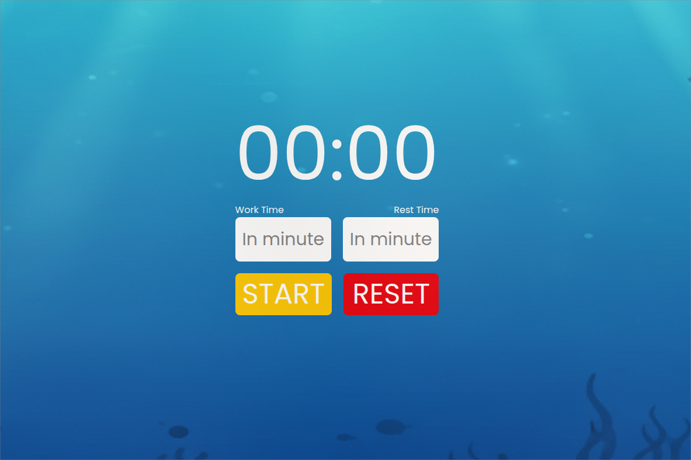

# 🍅 Pomodoro Timer

A simple and beautiful Pomodoro Timer desktop application built with Electron, Vite, TypeScript, and Tailwind CSS.



---

## ✨ Features

- ⏰ Set custom timers for work and rest periods.
- 🔔 Receive native desktop notifications when a session is complete.
- ✨ Sleek, modern UI with a background image.
- ▶️ Simple Start and Reset controls.

## 🛠️ Tech Stack

- **Framework**: [Electron](https://www.electronjs.org/)
- **Frontend**: [Vite](https://vitejs.dev/) + [TypeScript](https://www.typescriptlang.org/)
- **Styling**: [Tailwind CSS](https://tailwindcss.com/)
- **Notifications**: [node-notifier](https://github.com/mikaelbr/node-notifier)

## 🚀 Getting Started

Follow these instructions to get a copy of the project up and running on your local machine for development and testing purposes.

### Prerequisites

Make sure you have [Node.js](https://nodejs.org/) installed (which includes npm).

### Installation

1. Clone the repository:
   ```sh
   git clone <your-repo-url>
   ```
2. Navigate into the project directory:
   ```sh
   cd pomodoro-timer
   ```
3. Install the dependencies:
   ```sh
   npm install
   ```

### Running in Development Mode

To run the application in development mode with hot-reloading, you need to run two commands in **two separate terminals**:

1. **In Terminal 1**, start the Vite development server:
   ```sh
   npm run dev
   ```

2. **In Terminal 2**, start the Electron application:
   ```sh
   npm run start:electron
   ```

A new desktop window will appear with the application running. Changes to the frontend code in the `src` directory will automatically reload.

## 📦 Building for Production

To create a distributable package for your operating system, run the following command:

```sh
npm run build:electron
```

This command will first build the frontend assets into the `dist` folder and then package the entire application using `electron-builder`.

The final application package will be located in the `release` directory.

---

## ⚠️ Current Limitations

As a portfolio project, this application still has some limitations that provide room for improvement:

*   **No Pause Feature:** The timer can currently only be started and reset, not paused and resumed.
*   **Simple Input Validation:** Error messages for time inputs use the native `alert()`, which is not very user-friendly.
*   **No Session Persistence:** Work and rest time settings are lost every time the application is closed.
*   **Default Application Icon:** The application currently uses the default Electron icon when built.

## 💡 Future Improvements

Here are some ideas for future development to make this application more mature:

*   **Pause & Resume:** Implement functionality to pause and resume the timer.
*   **Settings Persistence:** Use a library like `electron-store` to save user settings, so they don't have to be re-entered each session.
*   **UI/UX Enhancements:**
    *   Add custom notification sounds for session completion.
    *   Replace native `alert()` with more elegant, inline UI error messages.
    *   Create a dedicated settings page or modal.
*   **System Tray Integration:** Allow the application to run in the system tray for quick access.
*   **Custom Application Icon:** Implement a unique application icon for branding.